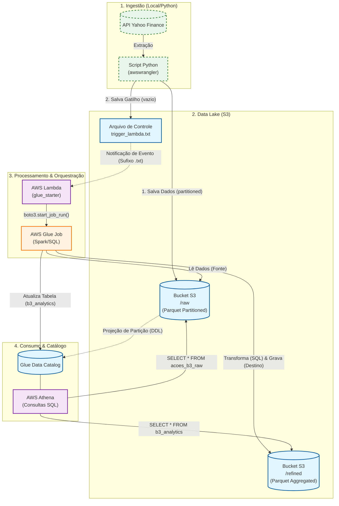

# Tech Challenge - Arquitetura de Big Data

Este projeto é um pipeline de Big Data que extrai dados financeiros da API do Yahoo Finance, os processa usando AWS Glue e os disponibiliza para consulta via AWS Athena.

## Arquitetura

O diagrama a seguir ilustra a arquitetura do pipeline:



### Fluxo de Dados

1.  **Ingestão**: O script `extrator.py`, executado localmente, busca dados diários de ações da API do Yahoo Finance para uma lista predefinida de tickers.
2.  **Armazenamento (Raw)**: O script usa a biblioteca `awswrangler` para salvar os dados no formato Parquet em um bucket S3 no diretório `/raw`, particionado por data.
3.  **Gatilho**: Após salvar os dados, o script cria um arquivo vazio chamado `trigger_lambda.txt` no diretório `/raw`. A criação deste arquivo aciona uma função AWS Lambda.
4.  **Orquestração**: A função AWS Lambda, definida em `glue_starter.py`, inicia um trabalho AWS Glue chamado `tech_challenge_job`.
5.  **Processamento**: O trabalho AWS Glue, definido em `tech_challenge_job.py`, lê os dados brutos do diretório `/raw`, agrega os dados para calcular o preço médio de fechamento mensal para cada ação e salva o resultado no formato Parquet no diretório `/refined` no mesmo bucket S3.
6.  **Catálogo de Dados**: O trabalho do Glue também atualiza o AWS Glue Data Catalog com uma tabela chamada `b3_analytics` que aponta para os dados refinados no S3.
7.  **Consulta**: Os dados refinados podem ser consultados usando AWS Athena.

## Pré-requisitos

*   Python 3.12
*   Conta AWS
*   AWS CLI configurado
*   Gerenciador de pacotes `uv`

## Como Executar

1.  **Clonar o repositório**:
    ```bash
    git clone <url-do-repositorio>
    cd <nome-do-repositorio>
    ```
2.  **Sincronizar dependências**:
    ```bash
    uv sync
    ```
3.  **Configurar variáveis de ambiente**:
    Crie um arquivo `.env` com o seguinte conteúdo:
    ```
    AMBIENTE=dev
    S3_BUCKET=<nome-do-seu-bucket-s3>
    ```
4.  **Executar o extrator**:
    ```bash
    uv run extrator.py
    ```
    Isso acionará todo o pipeline.

## Estrutura do Projeto

```
├───.gitignore
├───.python-version
├───extrator.py
├───glue_starter.py
├───pyproject.toml
├───tech_challenge_job.py
├───uv.lock
├───.git/
└───.venv/
```

*   `extrator.py`: Extrai dados do Yahoo Finance e os salva no S3.
*   `glue_starter.py`: Função AWS Lambda que inicia o trabalho Glue.
*   `tech_challenge_job.py`: Trabalho AWS Glue que processa os dados.
*   `pyproject.toml`: Configuração do projeto Python.
*   `uv.lock`: Arquivo de bloqueio do `uv`.
*   `.python-version`: Especifica a versão do Python para o ambiente `uv`.